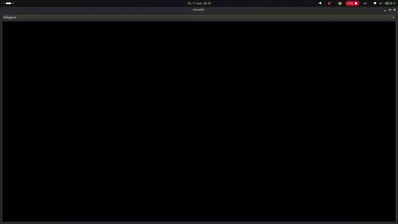
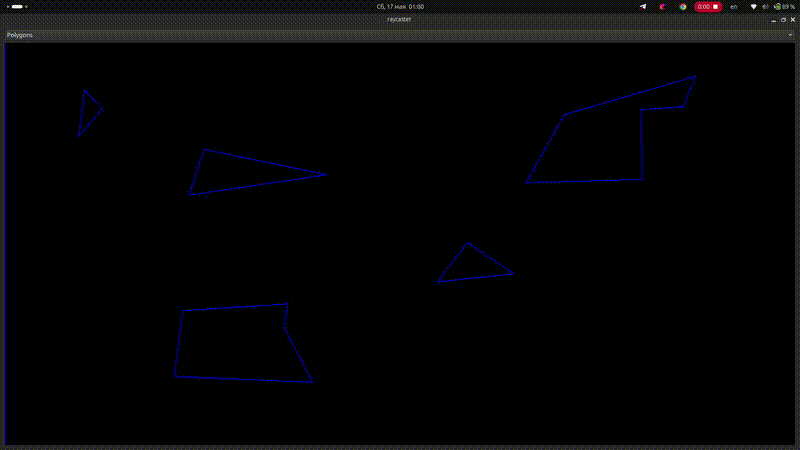

# RayCaster 💡

## This project implements 2-dimensional RayCaster

### Features
1. Creation of various polygons
2. Using of linear algebra theorems
   
   -Solving equations systems using Kramer's rule for finding intersections of rays with polygons
   
   -Using analytical geometry methods for ray rotatings and representation of rays

## Application using
1.Polygons creating

2.Raycaster launching

